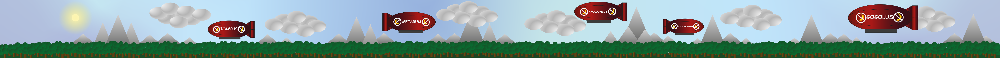

# 🐵 MonkeyTown - Village Interactif 3D




## 🎯 À propos du projet

MonkeyTown est une expérience web interactive qui combine visualisation 3D, mini-jeux éducatifs et contenu multimédia réalisé dans le cadre de la Nuit de l'Info 2025.

### ✨ Fonctionnalités principales

- **Village 3D interactif** : Navigation libre dans un environnement 3D créé avec Three.js
- **Huttes cliquables** : Chaque hutte (4) mène à une expérience différente
- **Mini-jeux éducatifs** : 
  - Jeu "Alternatives" pour découvrir des logiciels libres
  - Jeu "PC Upgrade" pour apprendre à upgrader un PC et installer Linux
- **Visualiseur audio rétro** : Lecteur audio avec effet CRT vintage
- **Interface Direction** : Présentation de l'équipe et des crédits
- **Design responsive** : Compatible desktop et mobile

## 🚀 Démarrage rapide

### Prérequis

- Un navigateur web moderne (Chrome, Firefox, Safari, Edge)
- Un serveur web local

### Installation

1. Clonez le dépôt :
```bash
git clone https://github.com/Yananas23/Singerie-Corp.-NDI.git
cd Singerie-Corp.-NDI
```

2. Lancez un serveur web local 

3. Ouvrez votre navigateur à l'adresse :
```
http://localhost:8000
```

## 📁 Structure du projet

```
Singerie-Corp.-NDI/
├── index.html              # Page principale avec le village 3D
├── chief.html              # Page Direction/Équipe
├── crt3d.html             # Visualiseur audio rétro CRT
├── credits.html           # Page de crédits
├── 404.html               # Page d'erreur 404
├── css/
│   ├── style.css          # Styles du village principal
│   ├── style-credits.css  # Styles de la page crédits
│   ├── style-games.css    # Styles des mini-jeux
│   ├── style-pc-upgrade.css
│   └── style-404.css
├── js/
│   ├── main.js            # Script principal Three.js
│   ├── script-games.js    # Logique du jeu Alternatives
│   ├── script-pc-upgrade.js # Logique du jeu PC Upgrade
│   ├── script-credits.js  # Animation des crédits
│   ├── script-404.js      # Animation page 404
│   └── modules/
│       ├── huts.js        # Création des huttes 3D
│       ├── terrain.js     # Génération du terrain
│       └── textures.js    # Gestion des textures
├── games/
│   ├── alternatives.html  # Jeu des alternatives logicielles
│   └── pc-upgrade.html    # Jeu d'upgrade PC
└── media/
    ├── favicon.ico
    ├── MonkeyTown.webm
    ├── fin.webm
    └── [autres assets graphiques]
```

## 🎮 Contenu des huttes

### 🏠 Hutte Direction
Côté narratif du site. Cette hutte est aussi une sensibilisation à la place des femmes dans le domaine de l'informatique.

### 🎵 Hutte Ecole de musique (CRT Visualizer)
Visualiseur audio rétro avec effet CRT vintage. Glissez-déposez vos fichiers audio pour les visualiser avec des effets rétro.

### 🎮 Hutte Ecole de langue
Mini-jeu éducatif où vous découvrez des alternatives libres aux logiciels propriétaires. Testez vos connaissances sur les logiciels open source !

### 🔧 Hutte Forge
Jeu interactif pour apprendre à :
- Changer la RAM d'un PC
- Installer une distribution Linux
- Comprendre les composants d'un ordinateur

### 📜 Hutte Crédits
Présentation de l'équipe et des ressources utilisées.

## 🛠️ Technologies utilisées

- **Three.js** (v0.169.0) - Moteur de rendu 3D WebGL
- **Tailwind CSS** - Framework CSS utilitaire
- **Vanilla JavaScript** - ES6+ Modules
- **HTML5 Canvas** - Pour les animations
- **Web Audio API** - Pour le visualiseur audio

## 🎨 Caractéristiques techniques

### Village 3D
- Rendu avec ombres portées (PCF Soft Shadows)
- Tone mapping ACES Filmic pour un rendu réaliste
- Contrôles OrbitControls pour la navigation
- Système de raycasting pour l'interaction avec les huttes
- Animations fluides avec damping

### Mini-jeux
- Interface réactive avec Tailwind CSS
- Système de progression par étapes
- Feedback visuel immédiat
- Design ludique et éducatif

### Visualiseur Audio
- Effet CRT vintage avec déformation
- Analyse spectrale de l'audio
- Visualisations 3D synchronisées
- Support drag & drop


## 📝 Licence

Ce projet est un projet éducatif réalisé dans le cadre de la Nuit de l'Info.

## 👥 Équipe

**Singerie Corp.**

- [Yanis Boulogne](https://github.com/Yananas23)
- [Timéo Radifison](https://github.com/Redfire117)
- [Clément Szewczyk](https://github.com/Clement-Szewczyk)
- [Julie Vandenberghe](https://github.com/julie-vandenberghe)
- [Steven Guillemet](https://github.com/GuillemetSteven)


---

<div align="center">
  
🐵 Fait avec ❤️ par Singerie Corp.

[🌐 Démo Live](https://yananas23.github.io/Singerie-Corp.-NDI/) 
</div>